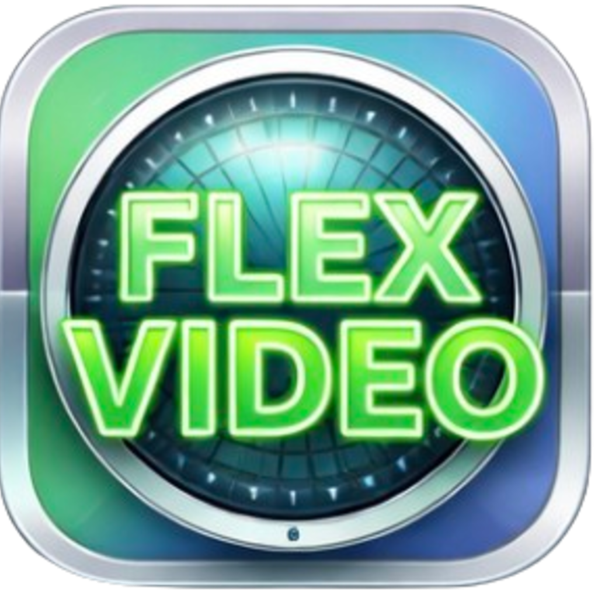

  

<h1 align="center">FLEX VIDEO</h1>

<strong>Один сценарий — готовые видео для публикации</strong>

  FLEX VIDEO превращает текст, стоковые материалы и ваши исходники в полноценные ролики с озвучкой, субтитрами, музыкой и оформлением.

  <strong><a href="https://t.me/flexer_soft_bot">Получить тестовый доступ на 1 день</a></strong>
  &nbsp;·&nbsp;
  <a href="https://github.com/feedose/FlexVideo/releases/latest">Скачать последнюю версию</a>
  &nbsp;·&nbsp;
  <a href="https://t.me/bablo_youtube">Задать вопрос</a>

---

## Публикуйте больше, монтируйте меньше

Добавьте сценарий, выберите источник видеоряда и запустите проект. FLEX VIDEO подготовит материалы, озвучит текст, оформит ролик и сохранит готовое видео для публикации.

Программа подходит для YouTube, Rutube, TikTok, информационных и тематических каналов, историй, обзоров и серийного производства контента.

## Выбирайте, из чего собирать видео

### Нейросетевая генерация

Создавайте изображения и видео по сценарию через **Fast-Gen** или **VeoNonStop**. Вы можете выбрать подходящий сервис генерации для своего проекта.

### Стоковые фото и видео

Используйте материалы из **Pexels** и **Pixabay**. Ролик можно собрать полностью из стоков — без генерации визуала.

### Собственные материалы

Загрузите свои фотографии, видео и заранее подготовленные фрагменты. FLEX VIDEO соберёт ролик только из ваших исходников или объединит их со стоками и генерацией.

## Получайте готовый комплект для публикации

- финальное видео с оформленным видеорядом;
- озвучка выбранным голосом;
- субтитры и фоновая музыка;
- заголовок, описание и теги;
- превью для публикации;
- версии видео на разных языках;
- отдельные профили настроек для разных каналов и форматов.

## Контролируйте результат

Просматривайте проект до финальной сборки, заменяйте отдельные изображения и видео, меняйте озвучку и повторно создавайте только те фрагменты, которые хотите улучшить.

## Работайте в подходящем режиме

**Полная генерация** — визуальный ряд создаётся по вашему сценарию.

**Генерация + собственные материалы** — ключевые сцены генерируются, а остальная часть собирается из выбранных исходников.

**Сборка без генерации** — готовое видео создаётся из стоков, собственных фотографий и видео.

## Windows и macOS

FLEX VIDEO выпускается для Windows и macOS. Проекты, исходники и готовые файлы сохраняются на вашем компьютере. При использовании генерации и стоков выбранные материалы обрабатываются соответствующими внешними сервисами.

## Попробуйте FLEX VIDEO

Оцените полный процесс на своём сценарии с тестовым доступом на 1 день.

**[Получить FLEX VIDEO](https://t.me/flexer_soft_bot)**

Обсуждение, вопросы и помощь: **[чат FLEX VIDEO](https://t.me/bablo_youtube)**.

---

Этот репозиторий используется для официальных установщиков и обновлений FLEX VIDEO. Исходный код продукта не публикуется.
